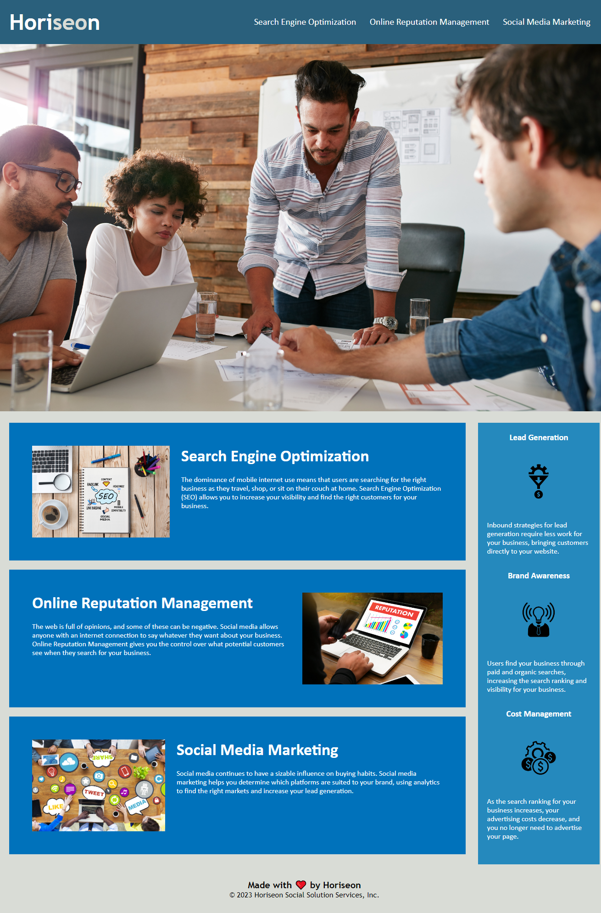

# Horiseon Marketing Agency

## Description

The motivation for this project was to take an existing webpage and make it more accessible to users. Refactoring the code allows users to use assisting tools like screen readers to access the site and use it to it's fullest. While working on this project I learned the importance of alt attributes on images as well as element semantics.

## Installation

None

## Usage

To access this website, simply follow the link provided below.

To add a screenshot, create an `assets/images` folder in your repository and upload your screenshot to it. Then, using the relative file path, add it to your README using the following syntax:

## License

N/A

